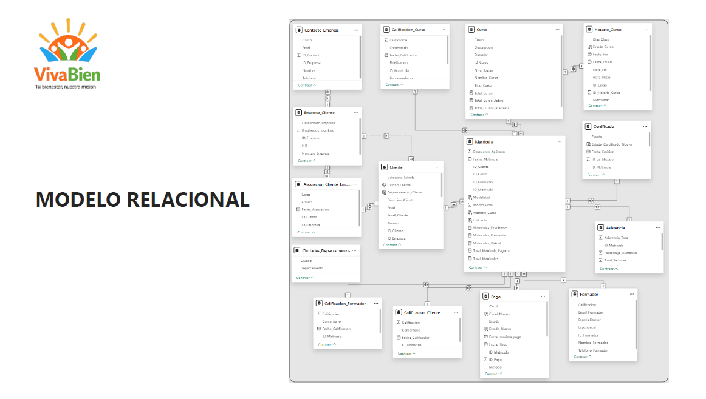

# INFORME EN POWER BI - VIVABIEN CAJA DE COMPENSACIÓN

## Inicio de la presentación del informe

## Modelo relacional en MYSQL

## Código fuente creado en Python para la generación de los datos sintéticos

## Stack de tecnologías

## Panorama general del negocio

## Portafolio de cursos

## Clientes y segmentación

## Sostenibilidad económica y comportamiento de pagos

## Recomendaciones

## Equipo de Datos

